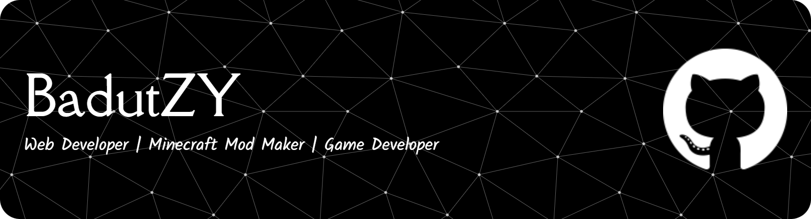

# About Me:
Currently I am a vibe coder with several AI such as  and . I usually make mods for Minecraft Java Edition, some of which I have released on Modrinth and Curseforge, and I also usually make websites with HTML, Java Script, CSS, or React JS. I am also learning coding at school with Laravel + Filament, PHP, and Java (GUI). I have also previously made a game with my team called Equinox Interactive which consists of 3 people, namely SwimmingFox, Ari8Bit, and BadutZY (me), a simple game made with Unity and C#, if you want to see more or download please visit Equinox Interactive.

###

###

### Tech Stack:

  
  
  
  
  
  
  
  
  
  
  
  
  
  
  
  
  
  
  
  
  
  
  
  
  
  
  
  
  
  
  
  
  
  
  
  
  
  
  
  
  
  
  
  
  

---

                         

###

###

## Social Media:

###

## My Team (Equinox Interactive):

## GitHub Stats:
GitHub Stats:

  
  
    
  
  

  ## You can help me by Donating:
  
